# 通用载具控制器脚本(Universal Controller)

## 如何安装

- 从创意工坊或者MOD.io下载脚本

- 放到可编程方块中（Programmable Block）

- 开关引擎、陀螺仪、轮子动力可以通过驾驶室的三个操控来设置（没有勾上就切断对应方块的电源）

  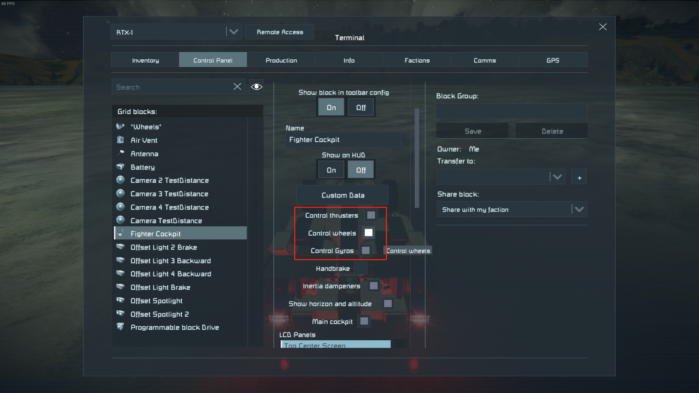

  ## **按照下面的说明配置控制参数**

- **使用转子推子时，需要将转子上边加上“ Engine”尾缀，默认使用转子的顶部方块的前方向（“Forward”）作为对齐（速度+重力）平面方向的参照向量，如果需要其他的，可在后面加上“Backward”、“Up”、“Down”、“Left”、“Right”、“Forward”来改变对齐向量，如果后面跟了“Normal”，就意味着优先考虑重力。**

  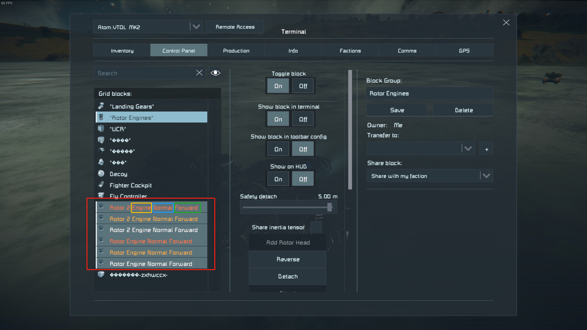

- **如果需要Dock Mode下联动连接器和起落架，请把“UCR”加在这些部件的尾部**

  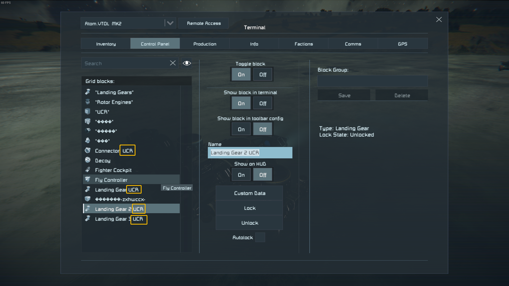

- 配置轮子，编组为“Wheels”支持两种类型的轮子：转子轮子（只支持差速转向）和悬挂轮子（多种支持，随动转向，履带差速[需要陀螺仪]，原地八字转向[速度低于5m/s时起作用]）

  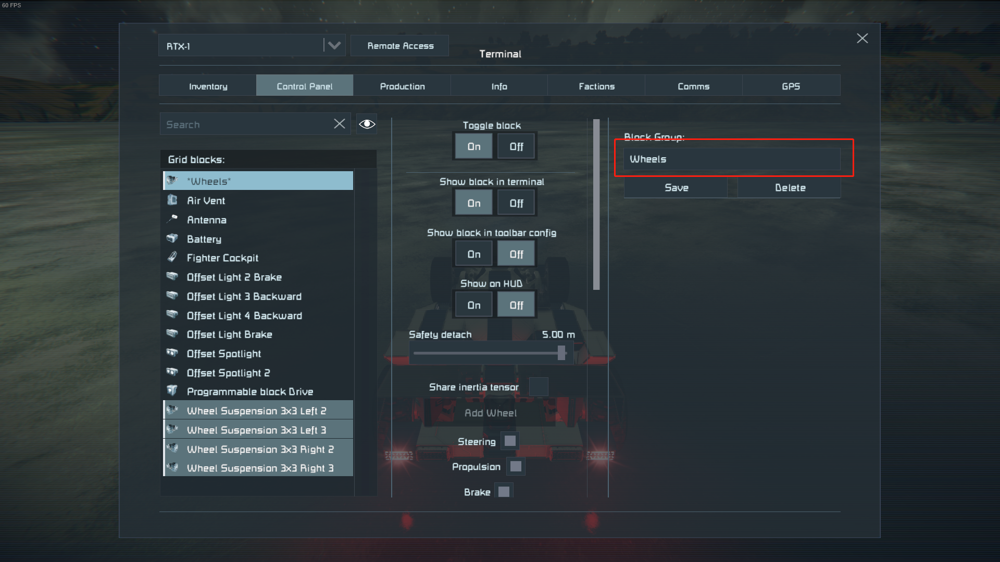

- 配置稳定摄像头名称（Custom Name后缀）：**TestDistance**

  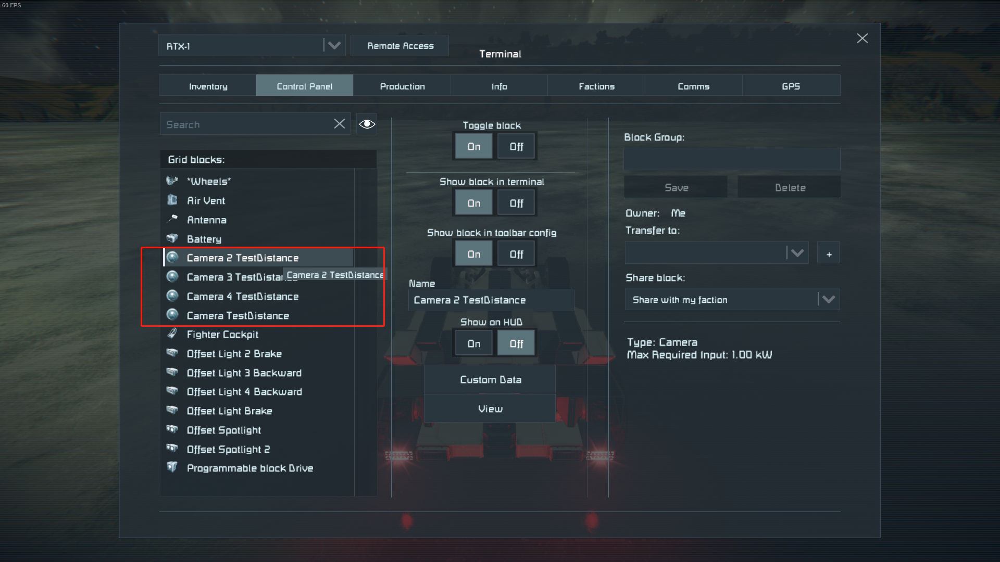

- 配置后轮名称（Custom Name后缀）：Rear（可选，否则默认计算）

- 如果需要倒车灯，在室内灯类型的灯后缀加上：Backward

- 如果需要刹车灯，在室内灯类型的灯后缀加上：Brake

  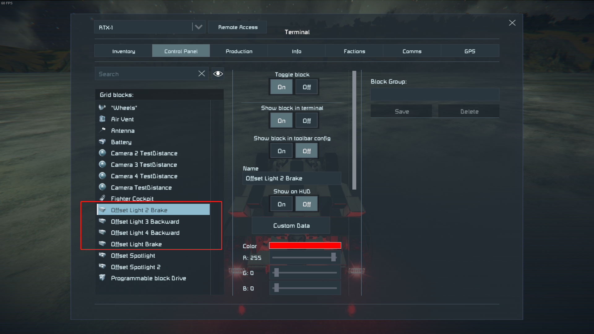

## 顶级命令(决定命令的控制类型)：

- -ControlLine：控制命令，有子命令

- -EditSetting：是否将配置文件显示在Custom Data中，有子命令

- -SaveData：保存配置文件，无子命令

## 次级命令（所有次级命令可以同时被读取）

### -ControlLine
​    -DockMode：停泊模式
​    -Hover：悬浮模式
​    -Cruise：巡航模式
​    -HasWings：是否有翅膀（适配 Plane Parts Mod，或者空气阻力MOD）
​    -SeaLevel：海拔模式，高度参照地面还是离地高度（确定离地高度，目前针对巡航模式的控制还在完善中）
​    -AllGravity：是否考虑所有的重力作为飞船的参考（确定自动滚转）
​    -IonThrust_OnOff：开关离子推进器
​    -AtomThrust_OnOff：开关空气推进器
​    -HydgenThrust_OnOff：开关氢气推进器

​	-EnabledKLang：开关Clang推进器
​	-EnabledGravity：开关重力推进器

### -EditSetting

​    -SICD_CommonSetup：将通用设置放到Custom Data以供编辑
​    -SICD_SpeedConfig：将速度设置放到Custom Data以供编辑
​    -SICD_ThrusterConfig：将推进器设置设置放到Custom Data以供编辑
​    -SICD_WheelsSetup：将轮子设置放到Custom Data以供编辑

### -SaveData

保存配置文件，无子命令，在可编程方块的参数中输入执行，会清空Custom Data中的配置，别担心，配置会保存在方块内的Config里面。

### -ChangeRole

-None（无控制）

-Aeroplane（飞机控制模式）

-Helicopter（直升机控制模式）

-VTOL（垂降飞机控制模式）

-SpaceShip（宇宙飞船控制模式）

-SeaShip（水中船控制模式）

-Submarine（潜艇控制模式）

-TrackVehicle（履带车控制模式）

-WheelVehicle（轮式车控制模式）

-HoverVehicle（悬浮载具控制模式）

## 参数解释

### “CommonSetup”通用设置段

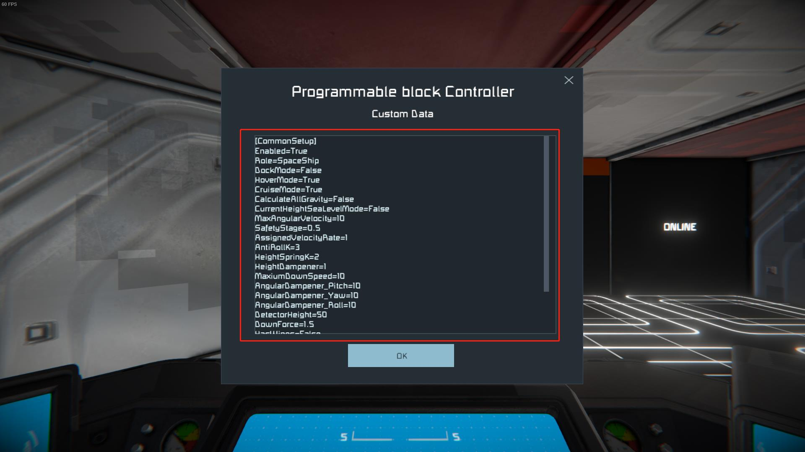


- 使用“ -EditSetting  -SICD_CommonSetup” 命令执行得到（无需复制本段代码）

```ini
[CommonSetup] 					
Enabled=True ;是否允许脚本控制（似乎有关闭有Bug）
Role=None 	;控制角色选择，可选择 None（无控制）, Aeroplane（飞机控制模式）, Helicopter（直升机控制模式）, VTOL（垂降飞机控制模式）, SpaceShip（宇宙飞船控制模式）, SeaShip（水中船控制模式）, Submarine（潜艇控制模式）, TrackVehicle（履带车控制模式）, WheelVehicle（轮式车控制模式）, HoverVehicle（悬浮载具控制模式）
DockMode=False ;是否是停靠模式，如果是，将采用停靠模式的速度（地面载具没有）
HoverMode=True	;是否使用盘旋模式（Role=VTOL、Role=SpaceShip用于选择盘旋速度），对于地面和水面载具来说，则是是否使用定速巡航
CruiseMode=False	；是否使用巡航模式（用于Role=VTOL、Role=SpaceShip、Role=Aeroplane），来使飞行器自动平飞
CalculateAllGravity=False ；飞行器平衡时是否考虑所有重力因素，是则考虑人工重力场，否则只有自然重力场
CurrentHeightSeaLevelMode=False ；当前高度模式设定，若为真则是考虑海拔，否则就是离地相对高度
MaxAngularVelocity=10 ；最大角速度，调大可以使飞船转向保持陀螺仪的教大出力
SafetyStage=0.5	；倾角安全等级，针对于（Role=VTOL、Role=Helicopter）在HoverMode=True下的最大倾角，0代表可以到90度，1则不倾斜
AssignedVelocityRate=0.1 ；这个是无人机的设置，未来会跟进制作
AntiRollK=1	；防倾等级，可以为小数，建议为1~5
HeightSpringK=0.1 ；高度与地面之间的模拟弹力
HeightDampener=2	；高度与地面之间的模拟弹力的阻尼，用于防止过度振动
MaxiumDownSpeed=10	；最大下降速度，再按住向下键时避免下降过快
Reactive_Velocity=10	；速度反应的灵敏度，调大可以使推子或者轮子反应灵敏，过大可能会震荡
AngularDampener_Pitch=1	；俯仰阻尼
AngularDampener_Yaw=1	；摆角阻尼
AngularDampener_Roll=1	；滚转阻尼
DetectorHeight=100		；摄像头的测距高度，一般50就够了
DownForce=1.5			；下压力加成（控制推子，只对轮式车辆有效）
HasWings=False			；是否使用翅膀（使用的话，在Role=VTOL、Role=Aeroplane关掉悬浮模式时，会在重力圈关掉侧面、上下、前面的推子）
GyroMultipy_Pitch=1		；陀螺仪灵敏度俯仰加成
GyroMultipy_Yaw=1		；陀螺仪灵敏度摆角加成
GyroMultipy_Roll=1		；陀螺仪灵敏度滚转加成
```

### “SpeedTable”通用设置段

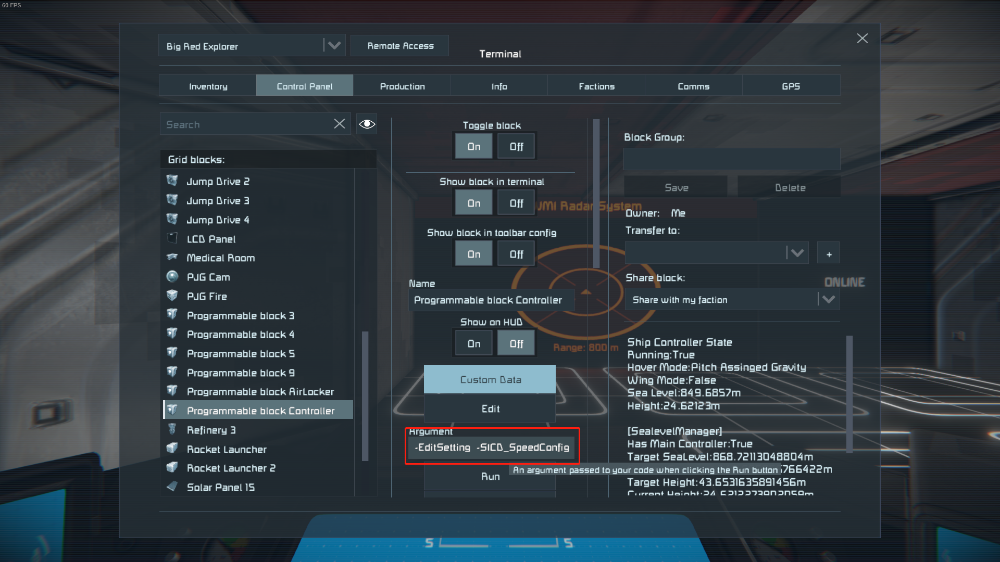


- 使用“ -EditSetting  -SICD_SpeedConfig” 命令执行得到（无需复制本段代码）

```ini
[SpeedTable]
MaxiumSpeed_Hover=30	;最大悬浮模式速度
MaxiumSpeed_Flight=120 	;最大飞行模式速度
MS_Dock=5				;最大停泊速度
MaxiumSpeed_Land=50	    ;最大陆地速度
MaxiumSpeed_Sea=30	    ;最大水中速度
MaxiumSpeed_Space=1000  ;最大太空速度
```

### “ThrusterOnOff”通用设置段（也可以通过-ControlLine直接设置）

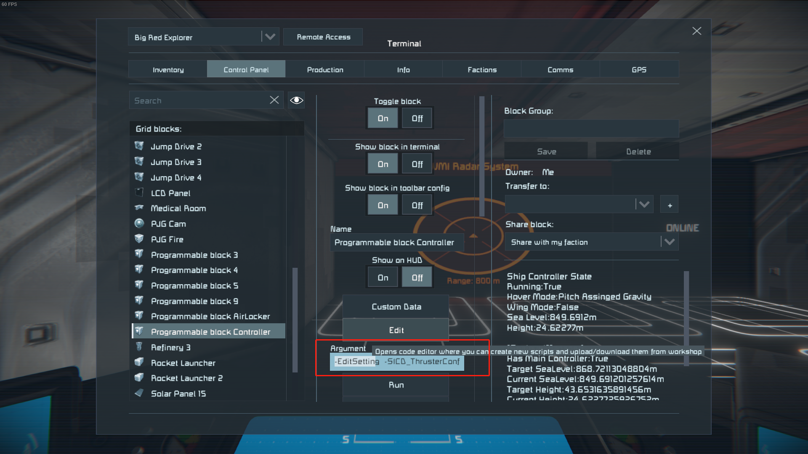

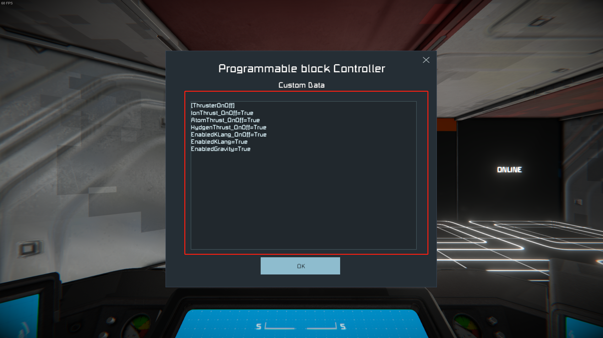


- 使用“ -EditSetting  -SICD_ThrusterConfig” 命令执行得到（无需复制本段代码）

```ini
[ThrusterOnOff]
IonThrust_OnOff=True		;是否开启离子推进器
AtomThrust_OnOff=True		;是否开启气动推进器
HydgenThrust_OnOff=True		;是否开启氢气推进器
EnabledKLang=True			;是否开启Clang推进器
EnabledGravity=True			;是否开启重力推进器
```

### “WheelsSetup”通用设置段


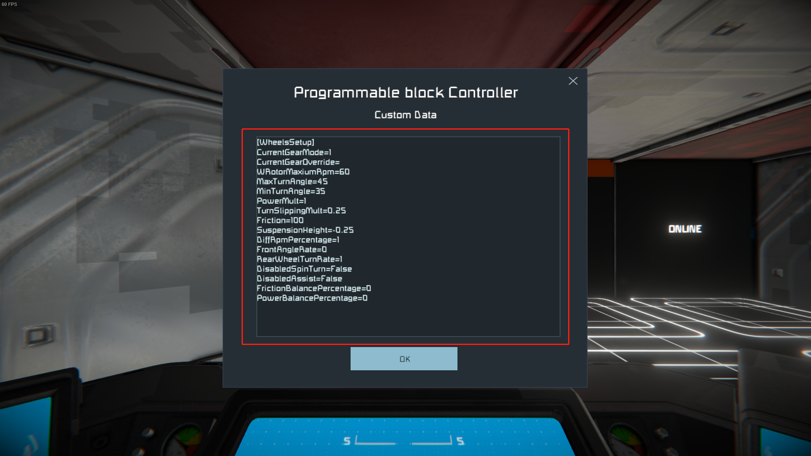

- 使用“ -EditSetting  -SICD_WheelsSetup” 命令执行得到（无需复制本段代码）

```ini
[WheelsSetup]
CurrentGearMode=1			;档位模式：1为普通模式，换挡慢，为了避免某些时候由于轮子出力过猛带来的抬头；2为运动模式，加速快；3为原始模式，放弃档位模拟
CurrentGearOverride=		;档位强制模式,空着不写，代表自动换挡，写数字代表强制挂在某档上，限制速度
WRotorDiffRpm=1				;使用转子作为轮子时，差速转向的速度差
WRotorMaxiumRpm=60			;使用转子作为轮子时，最大轮子的速度
MaxTurnAngle=45				;最大轮子转向角度（度数）
MinTurnAngle=45				;最小轮子转向角度（度数）若MinTurnAngle<MaxTurnAngle，角度会在随着速度的提高向MinTurnAngle减小
PowerMult=1					;功率出力，数值在0~1之间，代表百分比
TurnSlippingMult=0.25		;转向滑动参数（损失的摩擦力），履带控制模式下会减少车两端的轮子摩擦力，在民用车模式下，会在转弯时损失摩擦，适当设置避免转向不足（越大，后轮损失的摩擦力越多）
Friction=100				;总摩擦因素，100最大，0最小
SuspensionHeight=100		;弹簧高度：单位为米一般就0.25
DiffRpmPercentage=1			;悬挂轮子差速转向的差速比例，0~1之间
FrontAngleRate=-0.5			;向前倾斜的程度（负数表示向前倾斜，整数表示向后倾斜）
RearWheelTurnRate=0.3		;后轮转向比例（最大为1，最小为0[不转]）
DisabledSpinTurn=True		;是否不允许原地调头（允许的话，低于5m/s且不按前后键就会把轮子撇成八字旋转）
DisabledAssist=False		;是否取消辅助控制
FrictionBalancePercentage=0	;摩擦力平衡，如果为正，代表摩擦力偏后面，如果为负，代表摩擦力偏前面
PowerBalancePercentage=0	;动力平衡，如果为正，代表动力偏后面，如果为负，代表动力偏前面
```

## 常用命令

- -EditSetting -SICD_CommonSetup -SICD_ThrusterConfig -SICD_SpeedConfig -SICD_WheelsSetup			 查看配置文件
- -SaveData	 																																								保存编辑后的配置文件
- -ControlLine -DockMode																																			停泊模式
- -ControlLine -Hover																																					悬浮模式
- -ControlLine -HasWings																																			 是否有翅膀
- -ControlLine -Cruise																																			 	  巡航模式
- -ControlLine -IonThrust_OnOff																																开关离子推进器
- -ControlLine -AtomThrust_OnOff																															开关空气推进器
- -ControlLine -HydgenThrust_OnOff																														开关氢气推进器
- -ControlLine -EnabledKLang																													开关KLang推进器
- -ControlLine -EnabledGravity																													  开关人工重力场推进器

## 更新日志

- 2021/1/1 完成MOD版基础测试，初步可以控制None（无控制）, Aeroplane（飞机控制模式）, Helicopter（直升机控制模式）, VTOL（垂降飞机控制模式）, SpaceShip（宇宙飞船控制模式）, SeaShip（水中船控制模式）, Submarine（潜艇控制模式）, TrackVehicle（履带车控制模式）, WheelVehicle（轮式车控制模式）, HoverVehicle（悬浮载具控制模式）这些模式
- 2021/3/5完成DockMode、HoverMode、CruiseMode、HasWings的切换测试
- 2021/4/8开始传为Ingame Script的优化工作
- 2021/5/1发布V1.0基础版本
- 2021/5/1发布V1.1版本，去掉了**CivilCar**选项，增加了**向前倾斜的程度**、**后轮转向比例**、**是否不允许原地调头**这三项设置（至此，地面载具控制更新完结）

## 未来要做的

- 增加对转子引擎的控制（一元矢量或者二元矢量）
- 增加对Clang引擎的控制
- 增加强制拉升功能
- 增加自动驾驶模块
  - 目的地直达功能（更好的无人机控制）
  - 绕点盘旋功能（为了我能够做AC130）
  - 增加对探测器(Sensor Block)的支持（防止碰撞物体、比如母舰）
- 做一个MOD升级版，不加入方块，只是通过原版的驾驶室来实现这些控制，并且有更强大的防撞预测功能

